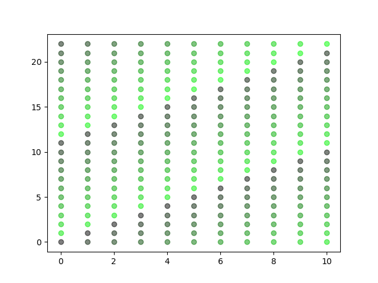
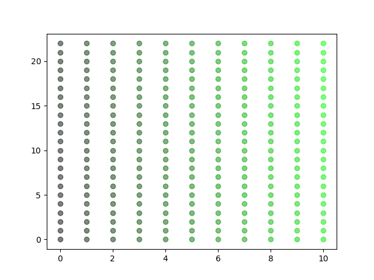

# Trying out Residu number systems.

Chapter 4.7 in Concrete Mathematics.

Example from p 127 coded

Can generate an alternative representation for values now.

If we know 254 is the max number, so we have [0-254], then we can
represent each of those values with the result of:

(n % 3, n % 5, n % 17) where n is [0-254].

The claim from Graham et. al. is that we can perform addition,
subtraction and multiplication on the components of the tuple
independently.

Their example is:

7 * 13 modulu 15.
The format is: (n % 3, n % 5)
7   = (1, 2)
13  = (1, 3)
(1, 2) * (1, 3) = (1*1 % 3, 2*3 % 5) = (1, 1).

(1, 1) is a unique representation for the number 1 here.

This is intersting in of itself. But it is also interesting if it is
sometimes possible to go the other way around.

Imagine having a 2D graph, and that given that you know what ranges
x and y values can be in we could represent any position (x,y) with a
single scalar value. This is ofc trivial if we just assign a strategy in
which order to visit all possible points in the graph. In fact,
this is what this does for you.

The image below plots all numbers [0-252] and has the prime factorization of 253 = 11 * 23.
When creating a tuple (n % 11, n % 23) for all n [0..252] we get all the points shown below.
The coloring indicates the order in chich they are created. It starts as black and gets
greener over time.

Notice that what happens. We start at (0,0). We climb up along the diagonal. When we reach an
edge we wrap around but continue with the motion. In this case x is smaller than y and so we
continue climbing up in y while wraping around x ever time we need.

It is possible for us to decide upone our own way of traversing the same space as the image
above for example. Let's say go up until we hit max y, then reset y and increment x instead.

Another method might be to choose all the points closest to (0,0) first in some order. It would
have the property that it works well with infinite large planes. But any order will do. 

But while any order might serve as a good representation there are some nice properties assosiated
with the sugested way given in chapter 4.7.

We now know we can generate the combinations without actually doing any modulus calculations,
just traverse the points in the correct order.

## Thinking about coordinate systems
Im trying to figure out the usefulness of this.

Imagine we have a game like snake where if you reach one end you wrap around and end up in the other end of the field.
The theory above states that we should be able to treat x and y seperately and still get the correct positions.

Imagine a 10x10 playing field.

Snake head is at (9, 0) and moves to the right -> x += 1. 
New positions is ((9 + 1) % 10, 0 % 10).

This was anticlimatic, because we already knew this right. Here it would have been clear that we can treat the x and y coordinates seperately.

Likewise if we have too poolar coordinates (a=255, r=1.0) and (a=615, r=1.0) we also know that to check if the positions are the same (modulu 360 degrees) we only need to check the angle alpha part. If there was a modulu for r we could check that independently.

So again, something we already knew.

I created snake.py as a sample application where we modify the position only as a scalar and then translate to a (x,y) coordinate only when we need to display it.

**realisation about snake** The thing is that while this works, there again is an anticlimatic realization.
We have all done this before. A 2D array is commonly just a 1D array in which we access the data in a certain pattern.
Often the pattern is 'array[x + y * WIDTH]'. One could, which is often done, use the value 'x + y * WIDTH' directly.
Here moving right/left is just  +/- 1. Moving up/down is +/- WIDHT which is a very simple system that works very well.

So the idea of using a scalar value to represent a 2D coordinate is already done in nifty hacks. This hack has the upside that it always works. The primefactor method only works for 2D coordinates when the total volumne of the space has 2 primefactors. So using 15 works due to 3*5 being available. But 100 wont work! So 10x10 board is not possible. So it does not feel like a good solution for these situations.

### How to find the unit vector representation?

If we have choosen to represent (x,y) positions for instance with a single scalar value it would be useful to know what scalar values represent the unit vectors (0, 1) and (1, 0).

If this value is known then we can move a position up by doing 7 + 6 for instance instead of adding in tuple space.

Again the book provides an answer. On page 128 it is mentioned that Euclid's algorithm can be used.

let m and n be the width and height such that the tuples are calculated by (num % n, num % m). 
In our previous example with modulu 15 n = 3 and m = 5.

    find m' and n' such that m * m' + n * n' = 1

This can be done with Euclid's algorithm (4.4, page 103).

    gcd(0, n) = n
    gcd(m, n) = gcd(n mod m, m)

    def gcd(m, n):
        if m == 0:
            return n
        else:
            return gcd(n % m, m)

## Does this work for any modulu?

The book explains that the prime factors need to be relatively prime.
So the factors for 15: (3, 5) work fine, but 256 (2, 2, 2, 2, 2, 2, 2, 2) wont.

A simple test shows that this seems to indeed be the case.

For numbers between 0-99 these are the only max_modulus in which duplicates were found.
Meaning that two values within that modulus had the same tuple representation.

The table below does not say which numbers had duplicates, on if there were any and what the prime factors are.

    4 duplicates found! - prime factors: [2, 2]
    8 duplicates found! - prime factors: [2, 2, 2]
    9 duplicates found! - prime factors: [3, 3]
    12 duplicates found! - prime factors: [2, 2, 3]
    16 duplicates found! - prime factors: [2, 2, 2, 2]
    18 duplicates found! - prime factors: [2, 3, 3]
    20 duplicates found! - prime factors: [2, 2, 5]
    24 duplicates found! - prime factors: [2, 2, 2, 3]
    25 duplicates found! - prime factors: [5, 5]
    27 duplicates found! - prime factors: [3, 3, 3]
    28 duplicates found! - prime factors: [2, 2, 7]
    32 duplicates found! - prime factors: [2, 2, 2, 2, 2]
    36 duplicates found! - prime factors: [2, 2, 3, 3]
    40 duplicates found! - prime factors: [2, 2, 2, 5]
    44 duplicates found! - prime factors: [2, 2, 11]
    45 duplicates found! - prime factors: [3, 3, 5]
    48 duplicates found! - prime factors: [2, 2, 2, 2, 3]
    49 duplicates found! - prime factors: [7, 7]
    50 duplicates found! - prime factors: [2, 5, 5]
    52 duplicates found! - prime factors: [2, 2, 13]
    54 duplicates found! - prime factors: [2, 3, 3, 3]
    56 duplicates found! - prime factors: [2, 2, 2, 7]
    60 duplicates found! - prime factors: [2, 2, 3, 5]
    63 duplicates found! - prime factors: [3, 3, 7]
    64 duplicates found! - prime factors: [2, 2, 2, 2, 2, 2]
    68 duplicates found! - prime factors: [2, 2, 17]
    72 duplicates found! - prime factors: [2, 2, 2, 3, 3]
    75 duplicates found! - prime factors: [3, 5, 5]
    76 duplicates found! - prime factors: [2, 2, 19]
    80 duplicates found! - prime factors: [2, 2, 2, 2, 5]
    81 duplicates found! - prime factors: [3, 3, 3, 3]
    84 duplicates found! - prime factors: [2, 2, 3, 7]
    88 duplicates found! - prime factors: [2, 2, 2, 11]
    90 duplicates found! - prime factors: [2, 3, 3, 5]
    92 duplicates found! - prime factors: [2, 2, 23]
    96 duplicates found! - prime factors: [2, 2, 2, 2, 2, 3]
    98 duplicates found! - prime factors: [2, 7, 7]
    99 duplicates found! - prime factors: [3, 3, 11]

The full representation when max_modulus is 4 is the following:
    0: (0, 0),
    1: (1, 1),
    2: (0, 0),
    3: (1, 1)
It is clear that the tuple representation is not enough to disambuigate which number it is representing.
(1, 1) could represent both 1 and 3 for instance.

So when choosing max_modulus a tip is to look at tables of non-square semiprimes for example as they are good candidates.
See this [oeis AOO6881 link](https://oeis.org/A006881/b006881.txt) for a list of all such numbers between 1 and 10 000. I even double checked, none of these values gives us a duplicate! So the list seems to be well generated.

### In what order are the tuples generated
I did not realise this at the start. But we will use the full space within the x and y domains. 
